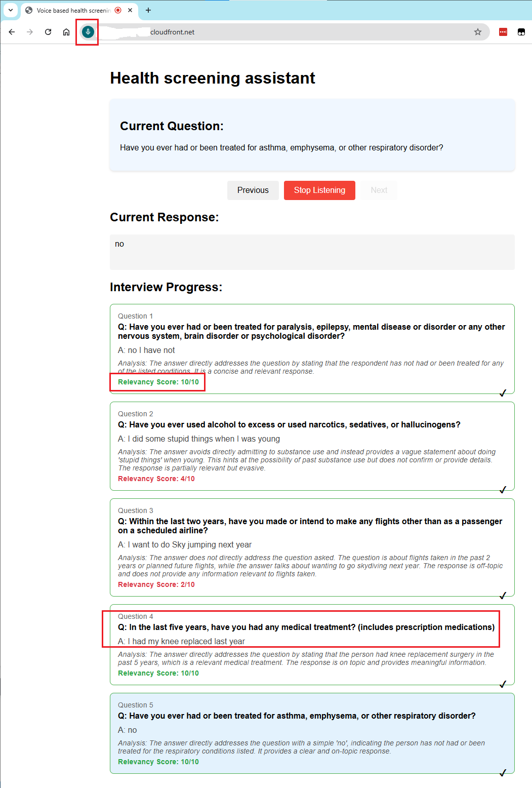

# GenAI Voice Health Screener

## Overview
An AI-powered voice interaction system that evaluates contextual relevance of responses to health screening questions. This solution helps agents automate client information collection using voice interactions and generative AI understanding.

## Technology Stack
- **Amazon Bedrock with Anthropic Claude**: For natural language understanding and context evaluation
- **Amazon Polly**: Text-to-speech synthesis for question delivery
- **Amazon DynamoDB**: Question repository storage
- **Amazon API Gateway**: RESTful API endpoints
- **AWS Lambda**: Serverless compute
- **Amazon S3**: Static website hosting
- **AWS CloudFormation**: Infrastructure as Code deployment

## Prerequisites
1. AWS Account with appropriate permissions
2. AWS CLI installed and configured
3. Python 3.11 or later
4. pip (Python package manager)
5. Amazon Bedrock with Claude 2 model access.

## Deployment Instructions

### 1. Clone the Repository
```bash
git clone https://github.com/yourusername/genai-voice-health-screener.git
cd genai-voice-health-screener
```

### 2. Deploy the Solution
```bash
./deploy.sh
....
..
Insertion completed successfully.
Successfully inserted questions into DynamoDB

Deployment completed successfully!

To access the application, open the following URL in Chrome browser:
https://xxxxxxxxx.cloudfront.net
```
Launch the application in a chrome browser.

### 3. Application usage instructions:

* Click on "Start Listening" button to enable microphone access
    * Ensure that the correct microphone is enabled in your browser
* The application starts reading the first question
* Provide a response verbally
* The response is analyzed using Generative AI to determine:
    * Relevancy to the question
    * Comprehensiveness of the answer
    * Score calculation (1-10 scale - 10 means perfectly relevant and comprehensive, and 1 means completely irrelevant or off-topic)
* For demonstration purpose, updates are made to UI styling based on the relevancy score. In a real world scenario, it can be used to ask follow up questions, or look up data, or take an action.





## Cleanup Instructions

To remove all deployed resources, simply run the cleanup script:

```bash
./delete.sh
